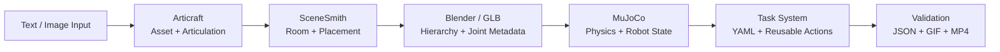

# Horizon Robotics Internship: Articulated Scenes and Robot Manipulation

**Dazhi Sun · June–August 2026**

This repository is a portfolio snapshot of my internship work on connecting
articulated-object generation, indoor-scene assembly, physics representation,
robot manipulation, and automated validation into one reproducible workflow.

The project combines [Articraft](https://github.com/mattzh72/articraft),
[SceneSmith](https://github.com/nepfaff/scenesmith), Blender/Three.js, and
[MuJoCo](https://mujoco.org/) to move from a generated articulated asset to a
validated robot task with configuration, trajectory data, evaluation reports,
and shareable demonstrations.

> The `articraft/` and `scenesmith/` directories are snapshots of the upstream
> research projects used during the internship. My work is described explicitly
> below and documented chronologically in `week1_note/` through `week11_note/`.

## Demo Highlights

| Industrial-printer service | Safety-interlocked sterilizer service |
| --- | --- |
| Open the service panel, operate and restore the toner tray, then close the panel. | Unlock the latch, open the panel, operate and restore the tray, close the panel, and relock. |
|  |  |
| 1 hinge + 1 slide · 24 actions · 942 validated states | 1 hinge + 2 slides · 38 actions · 1,487 validated states |

More representative results:

- [Multi-Articraft interactive room](week4_note/assets/week4_articulated_scene_demo.mp4)
- [Panda cabinet open–close task](week6_note/assets/videos/panda_open_close_cabinet.gif)
- [Sequential double-door manipulation](week7_note/assets/videos/level_5_sequential_open_both_doors.gif)
- [Same-configuration microwave pose generalization](week8_note/assets/microwave_pose_shifted_rotated_same_config.gif)
- [Dishwasher door-and-rack restoration](week10_note/assets/dishwasher_door_rack_restore.gif)

## End-to-End Workflow



The central engineering problem was preserving both **spatial layout** and
**articulation semantics** across these interfaces. A visually correct mesh is
not enough: the robot pipeline also needs link hierarchy, joint type, axis,
origin, limits, collision geometry, target frames, and queryable simulation
state.

## My Main Contributions

### 1. Articraft presentation and generation workflow

- Implemented direct Viewer MP4 export through a frontend–backend–Playwright–
  `ffmpeg` pipeline.
- Changed exported articulation demonstrations to sequential joint motion while
  preserving previously opened states.
- Replaced an unreliable Viewer readiness condition with explicit page and
  canvas checks.
- Added a Photo entry and optional motion description for image-guided asset
  generation workflows.

### 2. Articraft × SceneSmith integration

- Reconstructed rooms from saved geometry, furniture GLBs, and scene transforms.
- Rebuilt URDF hierarchy in Blender and preserved joint metadata in GLB.
- Added per-asset namespaces to avoid repeated link names such as `door`,
  `frame`, and `hinge` colliding across multiple URDFs.
- Added joint sliders, Reset, and multi-object control to the Three.js Viewer.
- Added placement, room-bound, collision, accessibility, browser, and checksum
  validation.

### 3. MuJoCo robot-task framework

- Reconstructed articulated joints and position actuators in MJCF and integrated
  both Stretch and mobile-Panda workflows.
- Implemented target-relative base goals, staged Cartesian approach, grasp IK,
  hinge-orbit following, prismatic-joint following, and target switching.
- Replaced scene-specific scripts with YAML configuration, `TaskState`, reusable
  actions, an executor, validators, and deterministic renderers.
- Added candidate-route generation and fallback when the preferred work pose is
  blocked.

### 4. Validation and structural repair

- Extended success criteria beyond final joint values to robot clearance,
  mechanism clearance, grasp continuity, support, and final restoration.
- Diagnosed Week 11's floating components as missing structural connections,
  then added grounding plinths, connectors, hinge mounts, guide rails, handle
  brackets, and payload supports.
- Added a full-trajectory structural audit that passes **118 / 118 checks**
  across six complex scenes.

## Selected Results

| Milestone | Evidence | Result |
| --- | --- | ---: |
| Multi-Articraft room assembly | Entry door, cabinet, and microwave | 8 joints, 23 sampled poses, 0 new collisions |
| Sequential two-door cabinet task | Mobile Panda with target switching | 429 states, local evaluation 100/100 |
| Moved and rotated microwave | Same YAML task configuration | 401 states, end-to-end PASS |
| Blocked preferred work pose | Automatic candidate-route fallback | 504 states, PASS |
| Dishwasher composite task | Door + internal rack + regrasp | 942 states, PASS |
| Industrial-printer service | Panel + toner tray | 942 states, strict validation PASS |
| Safety-interlocked sterilizer | Latch + panel + tray | 1,487 states, strict validation PASS |
| Week 11 structural repair | Six scenes | 118/118 checks PASS |

## Repository Guide

| Path | Contents |
| --- | --- |
| [`week1_note/`](week1_note/)–[`week3_note/`](week3_note/) | Python, articulated-scene, Articraft, SceneSmith, and Viewer workflow study |
| [`week4_note/`](week4_note/) | Multi-Articraft SceneSmith integration and interactive GLB Viewer |
| [`week5_note/`](week5_note/) | MuJoCo concepts, scene import, articulation reconstruction, and Stretch integration |
| [`week6_note/`](week6_note/) | First complete mobile-Panda cabinet open–close task |
| [`week7_note/`](week7_note/) | Difficulty progression and reusable task-system foundation |
| [`week8_note/`](week8_note/) | Target-relative generalization, automatic hinge orbit, and route fallback |
| [`week9_note/`](week9_note/)–[`week10_note/`](week10_note/) | Hinge, prismatic, and multi-mechanism demonstration tasks |
| [`week11_note/`](week11_note/) | Complex transfer prototypes, strict tasks, structural repair, and audit |
| [`articraft/`](articraft/) | Articraft source snapshot used and extended during the internship |
| [`scenesmith/`](scenesmith/) | SceneSmith source snapshot used and extended during the internship |
| [`internship final presentation/`](internship%20final%20presentation/) | Colleague-facing English and Chinese internship presentations |

## Reproducing Representative Tasks

The original environments are intentionally not committed. Reproduction
requires Python 3.11, MuJoCo, and the dependencies documented in the Articraft
and SceneSmith subdirectories.

From the repository root, the final accepted Week 11 tasks can be executed with:

```bash
MUJOCO_GL=egl python -m week11_note.scripts.run_validated_articulated_task \
  --config week11_note/configs/printer_service_panel_tray_restore.yaml

MUJOCO_GL=egl python -m week11_note.scripts.run_validated_articulated_task \
  --config week11_note/configs/sterilizer_safety_latch_panel_tray_reset.yaml
```

Use `--skip-render` for trajectory generation and validation without regenerating
the GIFs. Run the six-scene structural audit with:

```bash
MUJOCO_GL=egl python -m week11_note.scripts.audit_structural_support
```

## Scope and Limitations

The robot demonstrations validate reusable **kinematic** task generation and
collision-aware trajectory checking. They do not claim a learned policy,
camera-based perception, force-controlled grasping, or full contact-rich dynamic
manipulation. Current next steps include free-body payload dynamics, grasp and
contact constraints, broader self-collision coverage, and global motion
planning.

## Presentation and Detailed Documentation

- [Internship project and engineering contributions](internship%20final%20presentation/INTERNSHIP_COLLEAGUE_PRESENTATION.md)
- [Chinese presentation](internship%20final%20presentation/INTERNSHIP_COLLEAGUE_PRESENTATION_ZH.md)
- [Week 11 complex-task report](week11_note/COMPLEX_TASK_REPORT.md)
- [Week 11 structural issue and repair report](week11_note/WEEK11_ISSUE_REPORT.md)

## Attribution

- Articraft is maintained at
  [mattzh72/articraft](https://github.com/mattzh72/articraft); its original
  license and notices are retained in [`articraft/`](articraft/).
- SceneSmith is maintained at
  [nepfaff/scenesmith](https://github.com/nepfaff/scenesmith); its MIT license
  and citation information are retained in [`scenesmith/`](scenesmith/).
- Internship-specific code, reports, configurations, and generated results are
  presented here as portfolio evidence. No additional license is granted unless
  explicitly stated in a subdirectory.
