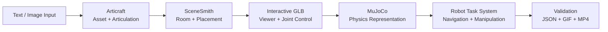
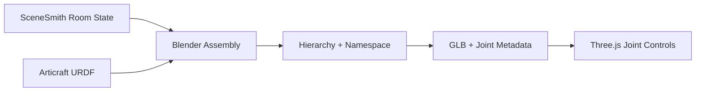
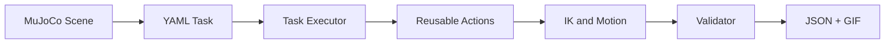

# Internship Project and Engineering Contributions

## Articraft × SceneSmith × MuJoCo: From Articulated Assets to Validated Robot Tasks

**Presenter:** Dazhi Sun  
**Internship:** June–August 2026  
**Presentation date:** August 25, 2026

[Chinese Version](INTERNSHIP_COLLEAGUE_PRESENTATION_ZH.md) · [Detailed Personal Version](INTERNSHIP_FINAL_PRESENTATION.md)

> My main internship contribution was connecting articulated-asset generation, scene assembly, physics simulation, robot manipulation, and evaluation into one reproducible engineering workflow while improving the usability of Articraft, SceneSmith integration, and MuJoCo task development.

---

## 01 · End-to-End Workflow



| Workflow stage | Main input | Main output | My focus |
|---|---|---|---|
| Asset generation | Text / image / motion description | Articulated object, URDF, record | Generation entry, Viewer motion, and MP4 export |
| Scene assembly | Room description + assets | Complete interactive scene | Multi-URDF assembly, joint preservation, namespaces, validation |
| Simulation | GLB / URDF / scene state | MJCF, joints, actuators, robot state | Articulation reconstruction and real robot models |
| Task execution | Scene + YAML task | Robot trajectory | Reusable actions, target-relative IK, candidate routes |
| Evaluation | Trajectory + geometry | PASS/FAIL, reports, GIF/MP4 | Collision, support, continuity, and final-state checks |

```text
Generated asset
→ demonstrable articulated object
→ multi-object interactive scene
→ queryable MuJoCo state
→ reusable robot task
→ validated and shareable result
```

---

## 02 · Responsibilities of the Three Core Systems

| System | Core responsibility | Question it answers |
|---|---|---|
| **Articraft** | Generates articulated objects and defines part hierarchy, joint type, axis, origin, and limits | What parts does the object contain, and how do they move? |
| **SceneSmith** | Generates rooms, furniture, placement, and scene state | Where is the object, and what surrounds it? |
| **MuJoCo** | Provides joint state, actuators, collision, contact, and robot simulation | Can a robot perform the interaction under explicit constraints? |

My work concentrated on the interfaces between these systems:

```text
Articraft URDF semantics
→ SceneSmith spatial composition
→ GLB interaction metadata
→ MuJoCo articulation and control
→ reusable robot tasks and evaluation
```

---

## 03 · Articraft Generation and Presentation Workflow

**Workflow position:** Input → **Articraft** → SceneSmith → MuJoCo → Robot Task → Evaluation

### Principle

```text
CLI input
→ generation runner and agent tools
→ model.py
→ compile_model
→ URDF and assets
→ saved record
→ Viewer
```

Generation quality depends on more than a mesh. It also depends on movable-part hierarchy, `REVOLUTE` / `PRISMATIC` / `CONTINUOUS` joints, axes, origins, limits, collision geometry, and functional clearance.

### Workflow Improvements

| Original issue | My improvement | User impact |
|---|---|---|
| Viewer motion was not directly shareable | Added a Viewer MP4 button, backend endpoint, Playwright capture, and `ffmpeg` encoding | No manual screen recording is required |
| Multiple joints moved simultaneously | Changed export to sequential joint motion | Each articulation is easier to inspect and explain |
| Earlier parts reset and hid later motion | Preserved previously opened states | Internal mechanisms remain visible |
| Export stalled at `Opening Viewer` | Replaced `networkidle` with `domcontentloaded` plus explicit canvas readiness | Background connections no longer cause an infinite wait |
| Generation was primarily text-driven | Added a Photo entry and optional motion description | Provides a product entry for image-guided generation; model-backed completion still depends on an available API |

[Watch the folding-toolbox sequential-motion MP4](../week3_note/examples/folding_toolbox.mp4)

**Summary:** Articraft moved from requiring manual presentation work after generation to supporting articulation inspection and shareable video export directly from the Viewer.

---

## 04 · Integrating Articraft Assets into SceneSmith

**Workflow position:** Input → Articraft → **SceneSmith + Assembly** → Interactive GLB → MuJoCo → Robot Task

SceneSmith provides room geometry, furniture, and transforms in `scene_state.json`. Articraft provides URDF links, joints, axes, limits, and visual origins. Integration must preserve both spatial layout and articulation semantics.



### My Improvements

- Decoupled floor-plan work from temporarily unavailable heavy services.
- Rebuilt the room from stored geometry, seven furniture GLBs, and scene transforms, then exported BLEND and browser-ready GLB artifacts automatically.
- Reconstructed URDF hierarchy in Blender and preserved joint metadata in GLB.
- Added per-asset namespaces to prevent repeated names such as `door`, `frame`, and `hinge` from colliding.
- Added joint sliders, Reset, and multi-object control to the Three.js Viewer.
- Added placement, room-bound, collision, accessibility, browser, and checksum validation.

| Result | Validation |
|---|---:|
| Static SceneSmith furniture | 6 objects |
| Articraft objects | Entry door, cabinet, microwave |
| Preserved joints | 8 |
| Sampled articulated poses | 23 |
| New self / furniture / inter-asset collisions | 0 |
| Required interaction regions | 4 / 4 reachable |
| Browser controls + Reset | 8 / 8 PASS |


[Watch the complete interactive-scene MP4](../week4_note/assets/week4_articulated_scene_demo.mp4)

**Summary:** Individual Articraft assets became reusable, controllable, and validated objects inside a complete SceneSmith room.

---

## 05 · From Individually Valid Joints to Valid Operations

**Workflow position:** Articraft → **Scene assembly + interaction rules** → MuJoCo → Robot Task → Evaluation

Individually valid joint ranges do not guarantee a valid combined state. Extending the microwave tray by approximately `0.11 m` while its door is closed creates a structural conflict.

```text
Request tray extension
→ check door angle
→ door < 1.50 rad: block tray
→ door ≥ 1.50 rad: allow tray

Request door close
→ tray extended: retract it first
→ close door
```

I added a door–tray interlock to the Viewer and verified locked, unlocked, and automatic-retraction behavior.

**Summary:** The Viewer began expressing operational preconditions and safe action order rather than treating every joint independently.

---

## 06 · Moving from Interactive GLB to MuJoCo

**Workflow position:** Articraft → SceneSmith → Interactive GLB → **MuJoCo** → Robot Task → Evaluation

GLB is appropriate for rendering, but a robot task needs explicit joints, collision geometry, mass, actuators, contacts, and queryable state. Imported GLB meshes do not automatically become controllable MuJoCo mechanisms, so the articulation layer had to be reconstructed in MJCF.

### Implementation

1. Imported the complete room as static geometry.
2. Reconstructed eight articulated joints in MJCF.
3. Added position actuators and verified targets through `data.ctrl` and `mj_step`.
4. Added a mobile-base prototype and then replaced it with the real Hello Robot Stretch model.
5. Combined navigation, alignment, lift, arm extension, and handle reaching.

| Milestone | Result |
|---|---|
| Static scene import | 86 geoms / 85 meshes |
| Articulation rebuild | 8 joints + 8 actuators |
| Real Stretch integration | 36 bodies / 26 joints / 16 actuators |
| Navigation | 3 / 3 waypoints reached |
| Handle reach | `0.0657 m < 0.08 m` threshold |


**Summary:** This stage established the bridge from an interactive visual scene to stateful robot simulation.

---

## 07 · First Complete Manipulation Baseline

**Workflow position:** Scene + MuJoCo → **Robot Manipulation** → Evaluation → Demo


```text
Navigate → Align → Approach → Grasp
→ Open → Hold → Close
→ Release → Retreat
```

### Core Implementation

- Used target-relative end-effector poses instead of hard-coded world coordinates.
- Solved Panda arm configurations with IK.
- Generated the gripper path from the hinge orbit while maintaining the two-finger grasp relationship.
- Validated trajectory continuity, target state, and final state.

**Summary:** The cabinet task completed the full scene-state-to-robot-action-to-evaluation loop and became the baseline for the reusable framework.

---

## 08 · From a Single Script to a Reusable Task System

**Workflow position:** MuJoCo Scene → **YAML Task + Executor + Actions** → Validator → JSON/GIF



| Component | Responsibility |
|---|---|
| `TaskState` | Stores base, arm, gripper, object joints, active target, and phase |
| YAML configuration | Defines bindings, targets, action parameters, and success goals |
| Reusable actions | Navigation, approach, grasp, hinge/slide following, release, retreat, reset |
| Executor | Runs actions and records one consistent trajectory |
| Validator | Checks overlap, contact, grasp, support, continuity, and final state |
| Renderer | Produces front/top GIFs and result summaries from the same trajectory |

| Before | After |
|---|---|
| A complete script per object | Reusable actions with scene bindings and YAML parameters |
| World-frame waypoints failed after object movement | Target-local offsets transform automatically |
| Execution and evaluation were mixed together | Executor, validator, and renderer are separated |
| Success depended on manual viewing | Trajectory JSON, summary, and GIF are produced together |

**Summary:** The unit of work changed from a successful animation to a configurable, reusable, and testable task definition.

---

## 09 · Generalization and Route Improvements

**Workflow position:** Reusable Task → **Cross-object / Cross-pose Generalization** → Validation

### Main Improvements

- **Target-relative poses:** base goals, approach poses, and hinge orbits update when an object is translated or rotated.
- **Candidate routes:** when the preferred work pose is blocked, candidates are validated and the first safe path is selected.
- **Automatic candidate generation:** YAML describes a search region and the program generates work poses and detours.
- **Automatic hinge orbit:** open/close paths are derived from the hinge frame and target geometry.
- **Cross-joint reuse:** navigation, approach, grasp, and reset are retained while `follow_slide_joint` replaces hinge following.

| Generalization test | Result |
|---|---|
| Translated and rotated microwave using the same configuration | 401 states, end-to-end PASS |
| Obstacle at the preferred work pose | Candidate fallback completed, 504 states PASS |
| Entry-door cross-object reuse | Open–hold–close PASS |
| Sliding-window prismatic task | 361 states / 11 actions / PASS |


**Summary:** The system moved from tuning waypoints for a known pose to deriving actions from the object frame and selecting a feasible route before execution.

---

## 10 · Composite Tasks and Stronger Validation

**Workflow position:** Generalized Actions → **Multi-target Task** → Full-Trajectory Validation → Demo

```text
Single hinge
→ open and close
→ multiple doors
→ hinge / prismatic cross-joint reuse
→ door + internal tray
→ latch + panel + tray + final restoration
```

| Validation layer | Coverage |
|---|---|
| Task goal | Reached/final joint value, payload destination, final gripper |
| Motion quality | Maximum joint step, continuity, lost grasp |
| Robot clearance | Robot–environment overlap and forbidden target contact |
| Mechanism clearance | Full-trajectory panel/tray/frame clearance |
| Structural support | Grounding, frame connection, hinge/handle mount, rail/support contact |
| Restoration | Required final state of doors, trays, panels, and latches |

The Week 11 floating-part defect was reclassified as structural disconnection rather than simply penetration. Repairs added plinths, frame connectors, hinge mounts, guide rails, handle brackets, and payload supports. The cross-scene structural audit now passes **118 / 118 checks**.

| Final task | Mechanisms | Actions / states | Expanded validation |
|---|---:|---:|---|
| Industrial printer | 1 hinge + 1 slide | 24 / 942 | PASS |
| Safety-interlocked sterilizer | 1 hinge + 2 slides | 38 / 1,487 | PASS |

**Summary:** A final result must establish not only task completion but also structural integrity, motion validity, support, and restoration.

---

## 11 · My Main Engineering Contributions

### 1. Articraft Product and Presentation Workflow

- Implemented the frontend–backend–Playwright–ffmpeg path for Viewer MP4 export.
- Added sequential joint motion and persistent states for previously operated parts.
- Added the Photo generation entry and optional motion description.

### 2. Articraft × SceneSmith Integration

- Rebuilt SceneSmith rooms automatically and integrated multiple Articraft URDFs.
- Preserved link hierarchy and joint metadata so the GLB was not merely a static mesh.
- Added per-asset namespaces, browser controls, Reset, and multi-layer validation.

### 3. MuJoCo and Robot Task Framework

- Reconstructed articulation and actuators in MJCF and integrated Stretch and Panda workflows.
- Implemented configuration-driven `TaskState`, executor, reusable actions, validator, and renderer.
- Supported hinge, prismatic, multi-target, candidate-route, target-switching, and final-restoration tasks.

### 4. Quality and Reproducibility

- Extended acceptance beyond joint goals to robot clearance, mechanism clearance, grasp continuity, support, and restoration.
- Repaired all six Week 11 scene structures and added 118 automated structural checks.
- Preserved XML, YAML, JSON, GIF, MP4, and Markdown evidence for reproducibility and review.

| Tool | Before | After my improvements |
|---|---|---|
| Articraft | Manual Viewer operation and separate screen recording | Sequential articulation display and direct MP4 export |
| SceneSmith integration | Room and articulated assets were separate; multi-URDF names collided | Automatic assembly with preserved joints, unified controls, and validation |
| MuJoCo task development | Scene-specific trajectory scripts | YAML + reusable actions + evaluator + renderer |

---

## 12 · Representative Results

### A. Articraft Sequential-Motion Export

[Watch the folding-toolbox MP4](../week3_note/examples/folding_toolbox.mp4)

Focus: joints move sequentially, earlier parts stay open, and the Viewer produces the video directly.

### B. SceneSmith × Multi-Articraft Interactive Room


[Watch the complete scene MP4](../week4_note/assets/week4_articulated_scene_demo.mp4)

Focus: one room contains an entry door, cabinet, and microwave with eight preserved joints and browser controls.

### C. Same-Configuration Pose Generalization


Focus: translation and rotation do not require rewritten action code; task poses update from the target frame.

### D. Hinge + Slide Composite Task


Focus: two joint types, two targets, release/regrasp, internal rack operation, and final restoration.

### E. Industrial-Printer Service


Focus: complete panel and toner-tray operation with expanded validation across 942 states.

### F. Safety-Interlocked Sterilizer Service


Focus: three mechanisms must follow unlock → open → tray operation → close → relock; all 1,487 states pass validation.

---

## Conclusion: Limitations and Next Directions

### Current Limitations

- The robot-task framework remains primarily kinematic.
- Free-body grasping, force/contact control, and dynamic settling after release are incomplete.
- Robot self-collision, payload–environment collision, and complex mechanism contact require broader coverage.
- Candidate-route selection is local and is not a global planner based on a navigation mesh, A*, or RRT.
- The Photo entry is implemented, but end-to-end image-guided generation quality still depends on the model service.

### Next Directions

1. Introduce free-body payloads with mass, inertia, and matching collision geometry.
2. Add grasp constraints, force/contact feedback, and post-release stability evaluation.
3. Unify collision, support, reachability, and task preconditions in a scene-level validator.
4. Add perception-based target localization to reduce dependence on known exact poses.
5. Connect SceneSmith scene understanding with automatic task generation and planning.

### Brief Reflection

My main takeaway is that when multiple research tools are connected into a stable workflow, interfaces, reproducibility, and validation criteria matter as much as the quality of a single generated result.

## Questions and Discussion
