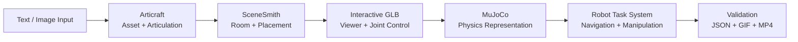
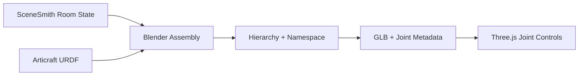
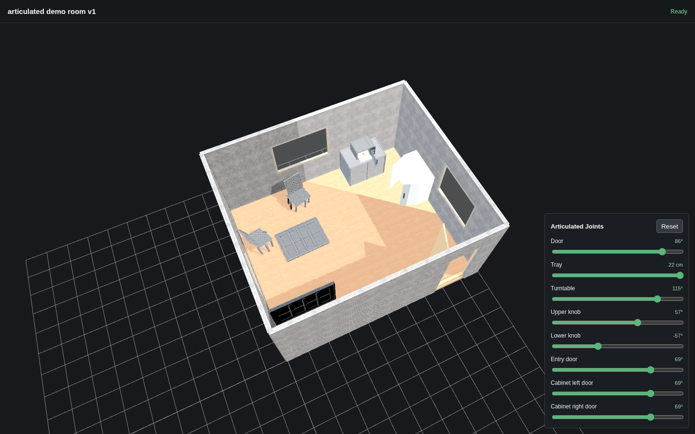

# 实习项目与工程贡献汇报

## Articraft × SceneSmith × MuJoCo：从铰接资产生成到机器人任务验证

**汇报人：** 孙达之  
**实习时间：** 2026.6–2026.8  
**答辩日期：** 2026.8.25

[English Version](INTERNSHIP_COLLEAGUE_PRESENTATION.md) · [个人留存的详细版本](INTERNSHIP_FINAL_PRESENTATION_ZH.md)

> 本次实习的主要工作，是把 articulated asset generation、scene assembly、physics simulation、robot manipulation 和 evaluation 连接为一条可复现的工程 workflow，并分别改善 Articraft、SceneSmith 集成和 MuJoCo task development 的使用效率。

---

## 01 · 整体 Workflow



| Workflow stage | 主要输入 | 主要输出 | 我的工作重点 |
|---|---|---|---|
| Asset generation | Text / image / motion description | Articulated object、URDF、record | 改进生成入口、Viewer motion 和 MP4 export |
| Scene assembly | Room description + articulated assets | 完整 interactive scene | 多 URDF 组装、joint preservation、namespace 和 validation |
| Simulation | GLB / URDF / scene state | MJCF、joint、actuator、robot state | 重建 articulation，接入真实 robot model |
| Task execution | Scene + YAML task | Robot trajectory | Reusable action、target-relative IK、candidate route |
| Evaluation | Trajectory + geometry | PASS/FAIL、report、GIF/MP4 | Collision、support、continuity 和 final-state validation |

### 总体结果

```text
单个生成资产
→ 可展示的 articulated object
→ 多物体 interactive scene
→ MuJoCo 可查询状态
→ 可复用机器人任务
→ 带验证与演示的完整结果
```

---

## 02 · 三个核心系统分别解决什么问题

| 系统 | 核心作用 | 在整体 workflow 中的位置 |
|---|---|---|
| **Articraft** | 生成 articulated object，并描述 part hierarchy、joint type、axis、origin 和 limit | 决定“物体由哪些部件组成、如何运动” |
| **SceneSmith** | 生成 room、furniture、placement 和 scene state | 决定“物体放在哪里、周围环境是什么” |
| **MuJoCo** | 提供 joint state、actuator、collision、contact 和 robot simulation | 验证“机器人能否执行交互、任务是否满足约束” |

我的工作不是只在其中一个模块内生成结果，而是处理三个系统之间的接口：

```text
Articraft URDF semantics
→ SceneSmith spatial composition
→ GLB interaction metadata
→ MuJoCo articulation and control
→ reusable robot task and evaluation
```

---

## 03 · Articraft：生成与展示 Workflow 优化

**Workflow position:** Input → **Articraft** → SceneSmith → MuJoCo → Robot Task → Evaluation

### 工作原理

```text
CLI input
→ generation runner and agent tools
→ model.py
→ compile_model
→ URDF and asset files
→ saved record
→ Viewer
```

生成质量不仅取决于 mesh，还取决于 movable part 的 hierarchy、`REVOLUTE` / `PRISMATIC` / `CONTINUOUS` joint、运动轴、origin、limit、collision geometry 和 functional clearance。

### 原有使用问题与我的优化

| 原问题 | 优化内容 | 对使用的影响 |
|---|---|---|
| Viewer 中的运动难以直接形成可分享材料 | 增加 Viewer MP4 button、backend endpoint、Playwright frame capture 和 `ffmpeg` encoding | 不需要手动录屏，可直接导出标准演示视频 |
| 多个 joint 同时运动，难以观察各部件作用 | 改为 sequential joint motion | 每个 articulation 更容易检查和讲解 |
| 后续 joint 运动时，已打开部件复位并遮挡内部结构 | 保留之前 part 的 open state | 多层结构能够按顺序完整展示 |
| Export 停在 `Opening Viewer` | 用 `domcontentloaded` + explicit canvas readiness 替代 `networkidle` | 消除 background connection 导致的无限等待 |
| 生成入口主要依赖文字 | 增加 Photo entry，并将 motion description 改为 optional | 为 image-guided generation 提供产品入口；model-backed end-to-end 仍依赖可用 API |

[查看 Folding Toolbox sequential-motion MP4](../week3_note/examples/folding_toolbox.mp4)

**小结：** Articraft 从“生成完成后需要人工整理展示”变成了“在 Viewer 内即可检查 articulation 并输出可分享视频”的 workflow。

---

## 04 · SceneSmith：把单体资产接入完整场景

**Workflow position:** Input → Articraft → **SceneSmith + Assembly** → Interactive GLB → MuJoCo → Robot Task

### 集成原理

SceneSmith 提供 room geometry、furniture assets 和 `scene_state.json` 中的 transform；Articraft 提供 URDF 中的 link、joint、axis、limit 和 visual origin。集成过程需要同时保留空间布局与 articulation semantics。



### 我的优化

- 将 floor-plan 与可用的 room/furniture artifact 分离，避免 heavy service 暂时不可用时整个流程停住。
- 使用保存的 geometry、7 个 furniture GLB 和 transform 自动重建房间并导出 BLEND/GLB。
- 在 Blender 中重建 URDF hierarchy，并把 joint metadata 保存到 GLB。
- 为每个 asset 增加 namespace，解决多个 URDF 都包含 `door`、`frame`、`hinge` 等同名节点的问题。
- 在 Three.js Viewer 中增加 joint slider、Reset 和 multi-object control。
- 增加 placement、room-bound、collision、accessibility、browser 和 checksum validation。

### 结果

| 结果项 | 验证结果 |
|---|---:|
| SceneSmith furniture | 6 个 static object |
| Articraft object | Entry door、cabinet、microwave |
| Preserved joint | 8 |
| Sampled articulated pose | 23 |
| 新增 self / furniture / inter-asset collision | 0 |
| Required interaction region | 4 / 4 reachable |
| Browser control + Reset | 8 / 8 PASS |



[播放完整 interactive-scene MP4](../week4_note/assets/week4_articulated_scene_demo.mp4)

**小结：** 这一步把 Articraft 的单体资产变成了可在 SceneSmith room 中复用、控制和验证的多物体 interactive scene。

---

## 05 · 从“可以操作”到“操作组合合理”

**Workflow position:** Articraft → **Scene assembly + interaction rules** → MuJoCo → Robot Task → Evaluation

单个 joint 的范围合法，并不代表多个 joint 的组合状态合法。Microwave door 关闭时，如果 tray 伸出约 `0.11 m`，就会出现结构冲突。

### 优化方式

```text
Request tray extension
→ check door angle
→ door < 1.50 rad: block tray
→ door ≥ 1.50 rad: allow tray

Request door close
→ tray is extended: retract tray first
→ close door
```

我在 Viewer 中增加了 door–tray interlock，并验证 locked、unlocked 和 auto-retract 三类行为。

**小结：** Viewer 不再只是独立控制 joint，而是开始表达 articulated object 的操作前置条件和安全顺序。

---

## 06 · MuJoCo：从展示场景进入机器人仿真

**Workflow position:** Articraft → SceneSmith → Interactive GLB → **MuJoCo** → Robot Task → Evaluation

### 转换原理

GLB 适合 rendering，但 MuJoCo task 还需要明确的 joint、collision geometry、mass、actuator、contact 和 state。导入 GLB mesh 后，articulation 不会自动变成可控制的 MuJoCo mechanism，因此需要在 MJCF 中重建。

### 我的实现

1. 导入完整 room 的 static geometry。
2. 在 MJCF 中恢复 8 个 articulated joint。
3. 为 joint 增加 position actuator，并通过 `data.ctrl` 和 `mj_step` 验证目标状态。
4. 先加入 mobile-base prototype，再替换为真实 Hello Robot Stretch model。
5. 组合 navigation、alignment、lift、arm extension 和 handle reaching。

| Milestone | 结果 |
|---|---|
| Static scene import | 86 geoms / 85 meshes 成功载入 |
| Articulation rebuild | 8 joints + 8 actuators |
| Real Stretch integration | 36 bodies / 26 joints / 16 actuators |
| Navigation | 3 / 3 waypoints reached |
| Handle reach | `0.0657 m < 0.08 m` threshold |


**小结：** 这一阶段建立了 interactive scene 与 robot simulation 之间的桥梁，使场景状态能够被机器人任务读取和控制。

---

## 07 · 第一个完整 Manipulation Baseline

**Workflow position:** Scene + MuJoCo → **Robot Manipulation** → Evaluation → Demo


### 完整任务

```text
Navigate → Align → Approach → Grasp
→ Open → Hold → Close
→ Release → Retreat
```

### 核心实现

- 使用 target-relative end-effector pose，而不是把所有 world coordinate 写死。
- 使用 IK 计算 Panda arm configuration。
- 根据 hinge orbit 生成 gripper path，并在运动中保持 two-finger grasp relation。
- 对 trajectory continuity、target state 和 final state 进行验证。

**小结：** Cabinet task 证明了从场景状态、机器人运动到结果验证的完整链路，并成为后续任务框架的 baseline。

---

## 08 · 从单任务脚本到可复用 Task System

**Workflow position:** MuJoCo Scene → **YAML Task + Executor + Actions** → Validator → JSON/GIF

### System Architecture


| Component | 作用 |
|---|---|
| `TaskState` | 保存 base、arm、gripper、object joint、active target 和 phase |
| YAML configuration | 描述 scene binding、target、action parameter 和 success goal |
| Reusable action | Navigation、approach、grasp、hinge/slide following、release、retreat、reset |
| Executor | 按顺序执行 action，并统一记录 trajectory |
| Validator | 检查 overlap、contact、grasp、support、continuity 和 final state |
| Renderer | 由同一 trajectory 生成 front/top GIF 和 result summary |

### 对开发效率的改善

| 以前 | 优化后 |
|---|---|
| 每个 object 编写一套完整脚本 | 复用 action，只更换 scene binding 与 YAML parameter |
| World-frame waypoint 随物体位置失效 | 使用 target-local offset 自动转换到 world frame |
| 执行与评估逻辑混在一起 | Executor、validator、renderer 分离 |
| 结果依赖人工观看 | 同时输出 trajectory JSON、summary 和演示 GIF |

**小结：** 工作单元从“一个成功动画”变成了“可配置、可复用、可检查的 task definition”。

---

## 09 · Generalization 与路径优化

**Workflow position:** Reusable Task → **Cross-object / Cross-pose Generalization** → Validation

### 关键优化

- **Target-relative pose：** object 平移或旋转后，base goal、approach pose 和 hinge orbit 一起更新。
- **Candidate route：** preferred work pose 被阻挡时，验证多个 candidate 并选择第一个安全路径。
- **Automatic candidate generation：** YAML 描述 search region，由程序生成 work pose 和 detour point。
- **Automatic hinge orbit：** 根据 hinge frame 和 target geometry 推导 open/close path。
- **Cross-joint reuse：** 保留 navigation、approach、grasp 和 reset，只用 `follow_slide_joint` 替换 hinge action。

| Generalization test | 结果 |
|---|---|
| Microwave 平移并旋转，使用同一 configuration | 401 states，end-to-end PASS |
| Preferred pose 被障碍物占用 | Candidate fallback 完成，504 states PASS |
| Entry door cross-object reuse | Open–hold–close PASS |
| Sliding window prismatic task | 361 states / 11 actions / PASS |


**小结：** 优化重点从“为已知位置调 waypoint”转向“从 object frame 推导动作，并在执行前选择可行 route”。

---

## 10 · Composite Task 与 Validation 升级

**Workflow position:** Generalized Actions → **Multi-target Task** → Full-Trajectory Validation → Demo

### 任务复杂度演进

```text
Single hinge
→ open and close
→ multiple doors
→ hinge / prismatic cross-joint reuse
→ door + internal tray
→ latch + panel + tray + final restoration
```

### 从 Goal Check 到完整检查

| Validation layer | 检查内容 |
|---|---|
| Task goal | Joint reached/final value、payload destination、final gripper |
| Motion quality | Maximum joint step、trajectory continuity、lost grasp |
| Robot clearance | Robot–environment overlap、forbidden target contact |
| Mechanism clearance | Door/panel/tray 与 frame 的 full-trajectory clearance |
| Structural support | Grounding、frame connection、hinge/handle mount、rail/support contact |
| Restoration | Door、tray、panel 和 latch 是否回到要求状态 |

Week 11 的 floating-part 问题最终被重新定义为 structural disconnection，而不是简单归类为 penetration。修复时增加了 plinth、frame connector、hinge mount、guide rail、handle bracket 和 payload support；六个场景的 structural audit 为 **118 / 118 PASS**。

| Final task | Mechanism | Actions / states | Expanded validation |
|---|---:|---:|---|
| Industrial printer | 1 hinge + 1 slide | 24 / 942 | PASS |
| Safety-interlocked sterilizer | 1 hinge + 2 slides | 38 / 1,487 | PASS |

**小结：** 最终结果不仅需要“机器人完成了动作”，还需要任务结构、运动过程、支撑关系和复位状态都能被验证。

---

## 11 · 我的主要工程贡献

### 1. Articraft 产品与展示 Workflow

- 实现 Viewer 内 MP4 export 的 frontend–backend–Playwright–ffmpeg 链路。
- 将 joint animation 改为 sequential motion，并保持已操作部件状态。
- 增加 Photo generation entry 和 optional motion description。

### 2. Articraft × SceneSmith 集成

- 自动重建 SceneSmith room，并接入多个 Articraft URDF。
- 保存 link hierarchy 和 joint metadata，使 GLB 不再只是 static mesh。
- 使用 per-asset namespace、browser control、Reset 和多层 validation 支持可复用 interactive scene。

### 3. MuJoCo 与 Robot Task Framework

- 在 MJCF 中重建 articulation 和 actuator，接入 Stretch 与 Panda robot workflow。
- 实现 configuration-driven `TaskState`、executor、reusable action、validator 和 renderer。
- 支持 hinge、prismatic、multi-target、candidate route、target switching 和 final restoration。

### 4. 质量与可验证性

- 将 joint goal 之外的 robot clearance、mechanism clearance、grasp continuity、support 和 restoration 纳入结果。
- 对 Week 11 六个场景完成 structural repair，并新增 118 项自动审计。
- 保留 XML、YAML、JSON、GIF、MP4 和 Markdown，使结果能够复现和复查。

### 对现有工具使用方式的改善

| 工具 | 优化前 | 优化后 |
|---|---|---|
| Articraft | 需要在 Viewer 中人工操作并自行录制结果 | 可顺序展示 joint，并直接导出 MP4 |
| SceneSmith integration | Room 与 articulated asset 分离，多 URDF 容易重名 | 可自动组装、保留 joint、统一控制并验证 |
| MuJoCo task development | Scene-specific trajectory script | YAML + reusable action + evaluator + renderer |

---

## 12 · 代表性作品

### A. Articraft Sequential-Motion Export

[播放 Folding Toolbox MP4](../week3_note/examples/folding_toolbox.mp4)

展示重点：多个 joint 按顺序运动，之前打开的 part 保持状态，视频可由 Viewer 直接生成。

### B. SceneSmith × Multi-Articraft Interactive Room


[播放完整场景 MP4](../week4_note/assets/week4_articulated_scene_demo.mp4)

展示重点：完整 room 中同时包含 entry door、cabinet 和 microwave，保留 8 个 joint 与 browser control。

### C. Same-Configuration Pose Generalization


展示重点：物体平移和旋转后无需重写动作代码，task pose 根据 target frame 自动更新。

### D. Hinge + Slide Composite Task


展示重点：两种 joint、两个 target、release/regrasp、内部 rack 操作以及最终复位。

### E. Industrial-Printer Service


展示重点：service panel 与 toner tray 的完整操作，942 states 通过 expanded validation。

### F. Safety-Interlocked Sterilizer Service


展示重点：必须按 unlock → open → tray operation → close → relock 的顺序操作三个 mechanism；1,487 states 验证通过。

---

## 总结：当前不足与后续方向

### 当前不足

- 目前 robot task framework 仍以 kinematic trajectory 为主。
- Free-body grasp、force/contact control 和 release 后的 dynamic settling 仍不完整。
- Robot self-collision、payload–environment collision 和复杂 mechanism contact 需要更广覆盖。
- Candidate route 属于局部候选选择，还不是基于 navigation mesh、A* 或 RRT 的 global planner。
- Photo entry 已完成产品入口，但 image-guided generation 的完整质量仍依赖 model service。

### 后续任务方向

1. 引入具有 mass、inertia 和匹配 collision geometry 的 free-body payload。
2. 增加 grasp constraint、force/contact feedback 和 post-release stability evaluation。
3. 将 collision、support、reachability 和 task precondition 统一到 scene-level validator。
4. 接入 perception-based target localization，减少已知精确 pose 的依赖。
5. 将 SceneSmith 的 scene understanding 与自动 task generation、planning 连接起来。

### 一点个人感受

这次实习让我最直接的体会是：把多个研究工具连接成稳定 workflow 时，接口、可复现性和验证标准与单次生成效果同样重要。

## Questions and Discussion
