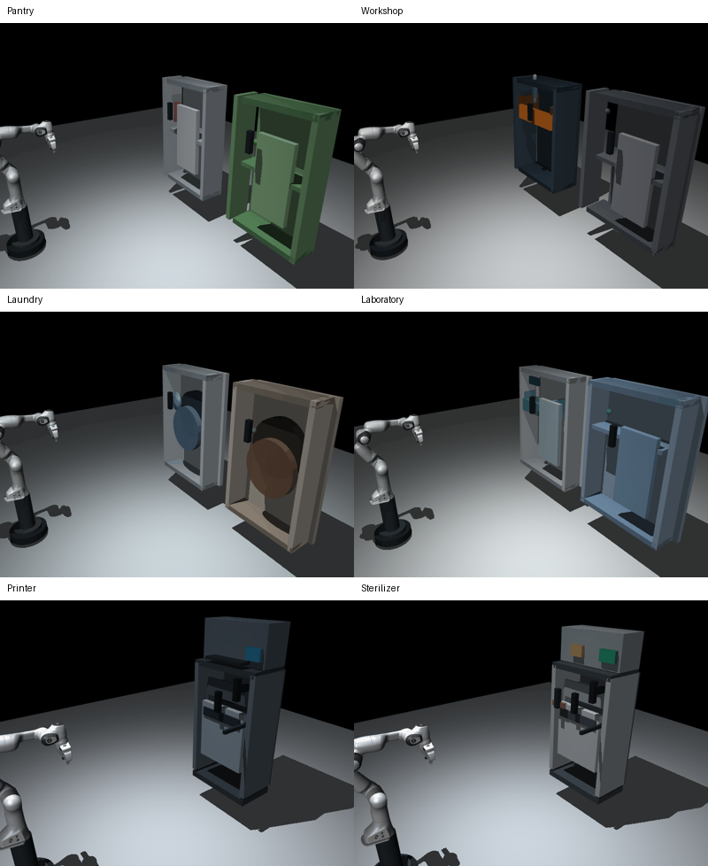
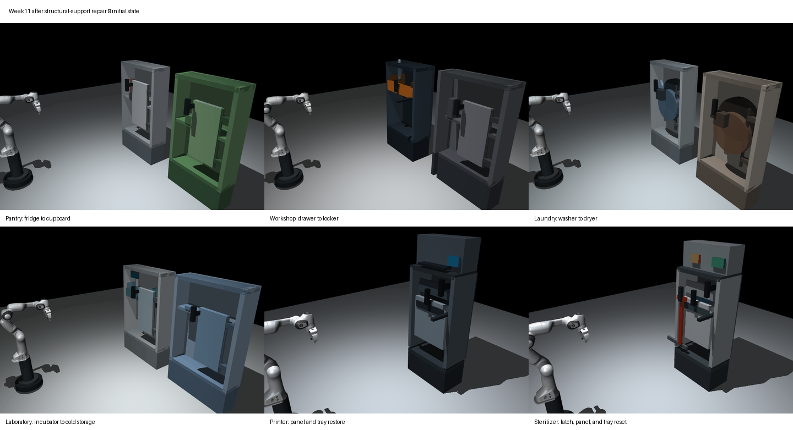

# Week 11 Structural Floating-Part Repair Report

## 1. Corrected Problem Definition

The main visual defect was not mesh penetration. The articulated objects contained parts that were positioned near one another but had no visible structural connection or support. This made cabinet panels, handles, hinge parts, rails, control modules, and internal payloads appear to float.

The defect affected all six Week 11 scenes. It was easy to miss because reaching a joint goal or avoiding robot overlap does not prove that the environment forms a connected, supported structure.

## 2. Repair Result

All six scenes have now been structurally repaired and rerendered.

- Scene bodies are grounded through explicit plinths or feet.
- Fixed frame parts touch a base, back panel, side panel, or connector.
- Moving doors, panels, drawers, trays, and latches have visible hinge, guide, or rail connections.
- Handles are attached through mounting brackets.
- Stored items rest on a shelf, tray, pedestal, drum platform, or other explicit support in their initial and final states.
- Connections that must remain valid during motion are checked across every recorded trajectory state.

The new structural audit passes **118 / 118 checks across all six scenes**, with **0 failures**.





## 3. Scene-by-Scene Repairs

| Scene | Structural repairs | Audit result |
|---|---|---:|
| Pantry | Added ground plinths, connected cabinet frames, explicit hinge pins and mounts, handle brackets, and source/destination can supports | 18 / 18 PASS |
| Workshop | Grounded the tool chest and locker, connected the offset locker side through a rear brace and foot, attached the drawer to a continuous track, joined drawer walls and handle, and added tool supports | 22 / 22 PASS |
| Laundry room | Grounded and connected both machine frames, mounted both drums, added hinge and handle mounts, and connected the laundry platforms to the drums through support brackets | 21 / 21 PASS |
| Laboratory | Grounded both cabinets, attached the display, hinges, handles, and sliding-tray rail, and added supported source and destination sample stands | 21 / 21 PASS |
| Industrial printer | Grounded the printer, attached the upper module and output shelf, connected the service-panel hinge and handle, mounted the toner-tray rail, and placed the cartridge on the tray bottom | 16 / 16 PASS |
| Industrial sterilizer | Grounded the sterilizer, attached the control module, panel hinge, handle, and tray rail, connected the moving latch through a guide and linkage, and placed the instrument pack on the tray | 20 / 20 PASS |

## 4. Validation Method

The new audit loads each MuJoCo scene and its recorded trajectory, applies the articulated state, and checks world-space geometry relationships.

Three types of evidence are covered:

1. **Grounding:** the lowest point of every main support plinth or foot touches the ground plane.
2. **Attachment:** frame members, mounts, hinges, handles, guides, and rails touch the component they support.
3. **Operational support:** sliding trays remain on their tracks throughout the full trajectory, and transferred objects touch their intended support in the initial and final states.

The machine-readable result is stored in [`results/structural_support_audit.json`](results/structural_support_audit.json). The audit can be rerun with:

```bash
scenesmith/.mujoco_venv/bin/python -m week11_note.scripts.audit_structural_support
```

The regenerated initial/final review sheet is available at [`assets/week11_support_repair_initial_final_review.png`](assets/week11_support_repair_initial_final_review.png).

## 5. Regression Results

All six repaired scenes still complete their configured action sequences.

| Scene | States | Actions | Task result | Structural result |
|---|---:|---:|---|---|
| Pantry | 1,139 | 24 | PASS | PASS |
| Workshop | 1,210 | 24 | PASS | PASS |
| Laundry room | 1,139 | 24 | PASS | PASS |
| Laboratory | 1,457 | 31 | PASS | PASS |
| Industrial printer | 942 | 24 | Strict validation PASS | PASS |
| Industrial sterilizer | 1,487 | 38 | Strict validation PASS | PASS |

The printer and sterilizer tasks also retain zero robot-overlap, mechanism-clearance, tray-support, visual-collision-coverage, and lost-grasp failures under their expanded validators.

## 6. Scope of This Repair

This repair resolves the reported structural floating-part problem. It does not claim that every physical limitation of the four earlier transfer prototypes has been removed. Those tasks still use kinematic payload transport and their original validators do not provide the same complete collision and dynamics coverage as the printer and sterilizer tasks. They should remain labeled as motion-sequence prototypes.

The industrial-printer and industrial-sterilizer tasks remain the recommended final Week 11 demonstrations because they pass both the structural audit and the expanded full-trajectory acceptance checks.
