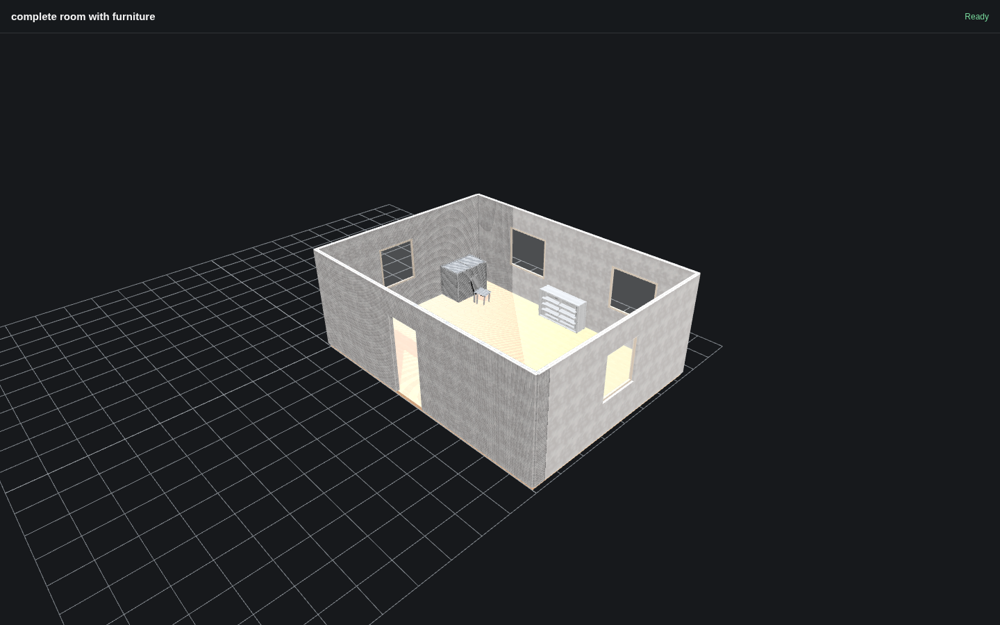
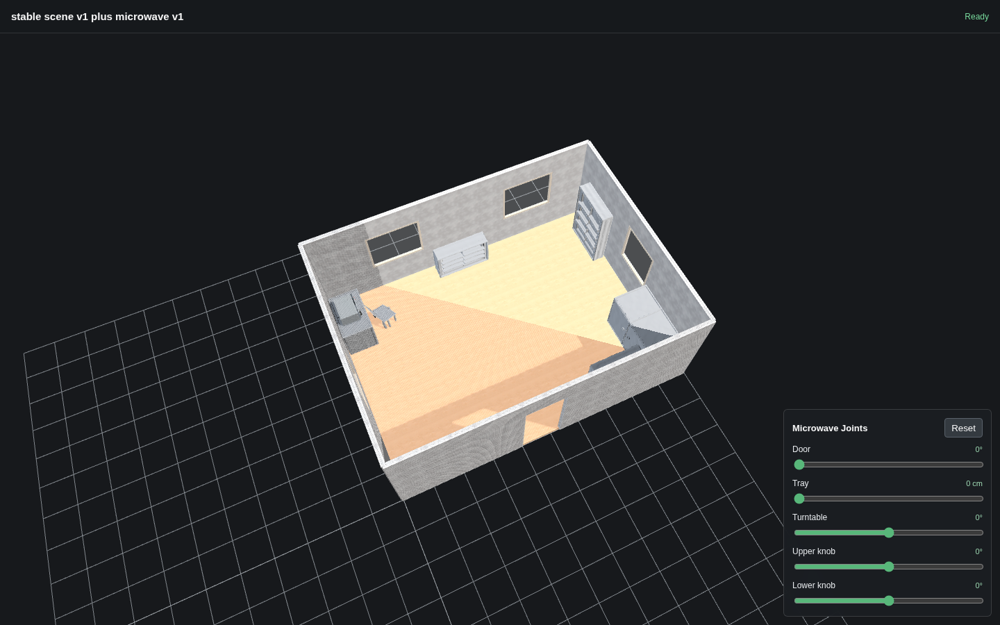
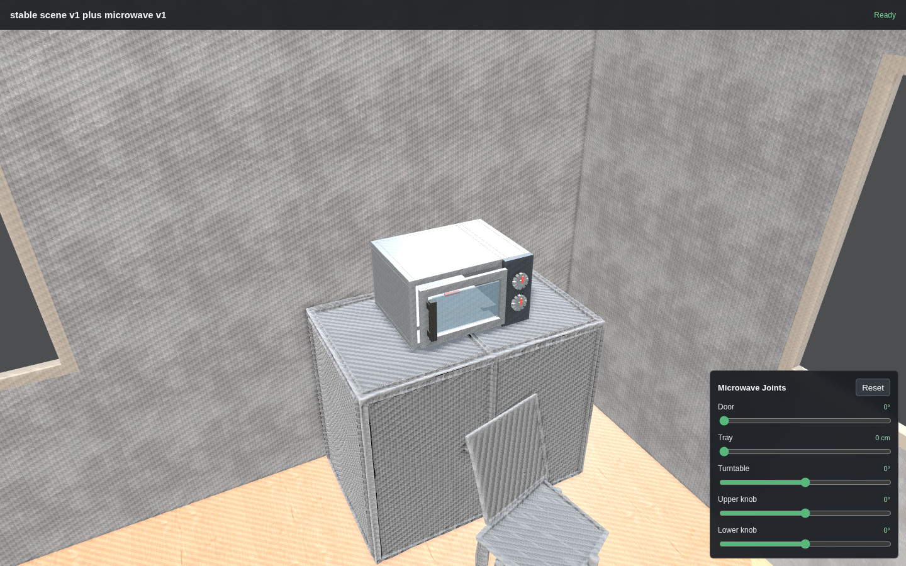
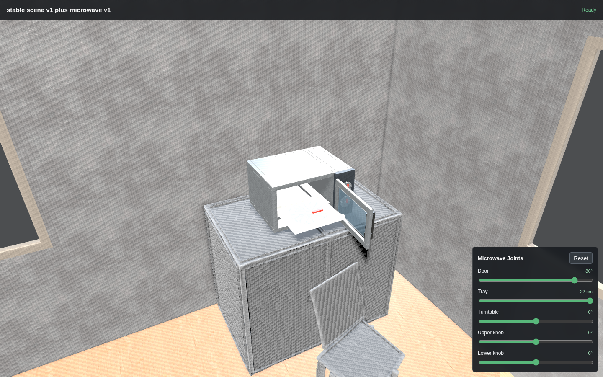
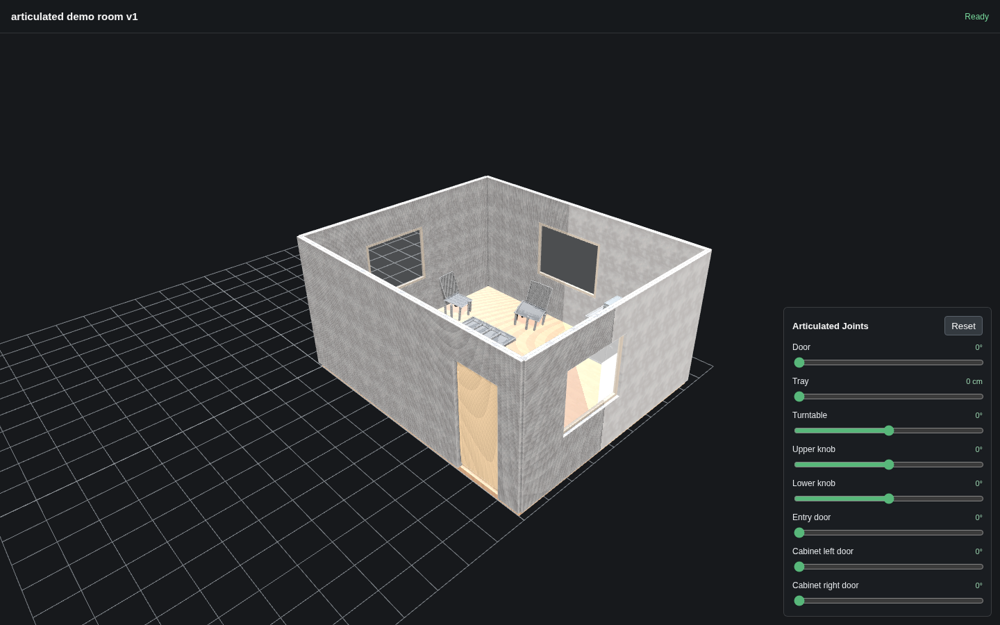
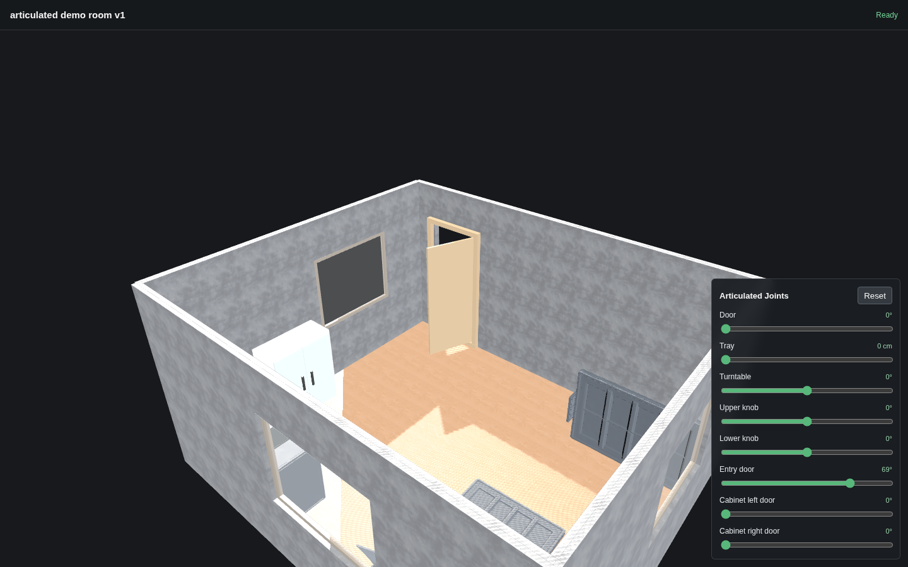
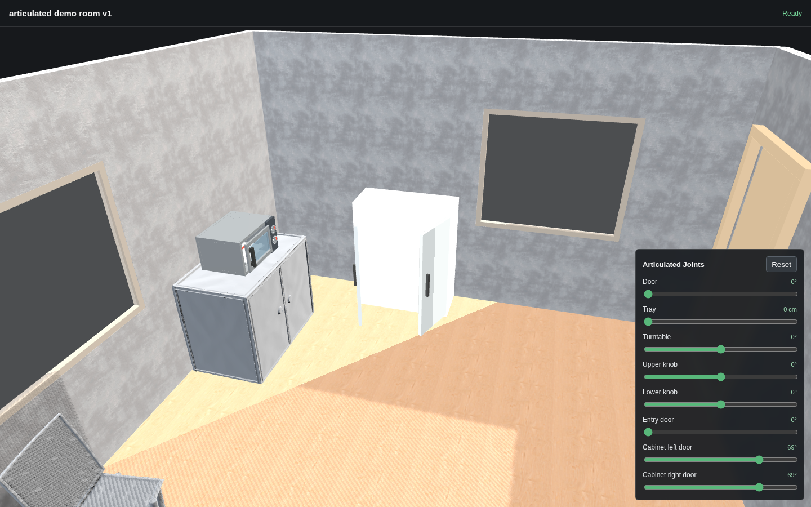
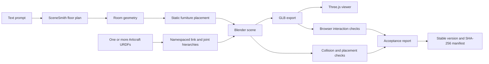

# Week 4: From Generated Rooms to Interactive 3D Scenes

This repository documents a small but complete 3D scene-generation workflow
built around **SceneSmith**, **Articraft**, Blender, glTF/GLB, and Three.js.

The goal of the week was not to reproduce every research-stage dependency.
Instead, I built and validated an engineering loop that can:

1. Generate an indoor floor plan with SceneSmith.
2. Assemble a room with seven static furniture assets.
3. Export the complete scene to GLB without opening Blender manually.
4. Import an articulated Articraft microwave from URDF.
5. Scale the integration to an entry door, a double-door cabinet, and a
   microwave in one scene.
6. Preserve and control eight joints in a browser viewer.
7. Validate placement, motion, collision, accessibility, and version integrity.

[Quick project overview](README_quick_overview.md)

## Project Progression

| Version | Static furniture | Articulated objects | Joints | Result |
| --- | --- | --- | --- | --- |
| `stable_scene_v1` | 7 | 0 | 0 | Static room accepted |
| `stable_scene_v1_plus_microwave_v1` | 7 | 1 microwave | 5 | PASS |
| `articulated_demo_room_v1` | 6 | Entry door, cabinet, microwave | 8 | PASS |

The latest demo sampled 23 articulated poses with zero new self-collisions,
furniture collisions, inter-asset collisions, or room-bound violations. All
four required interaction areas were reachable from the open entrance.

### Static Scene Overview



### Integrated Scene Overview



### Closed State



### Open State



### Multi-Object Articulated Scene








[Watch the 13.6-second articulated scene demo](assets/week4_articulated_scene_demo.mp4)

## System Overview



## What I Worked On

- Isolated SceneSmith's floor-plan-only stage from unavailable heavy services.
- Converted Blender scene outputs into browser-viewable GLB files.
- Combined room geometry and separately generated furniture into one scene.
- Parsed an Articraft URDF and recreated its link/joint hierarchy in Blender.
- Built a reusable multi-URDF assembler with per-asset namespaces.
- Preserved revolute, prismatic, and continuous joint metadata in GLB.
- Added browser sliders that drive the articulated joints.
- Sampled 23 multi-object poses to detect self, furniture, inter-asset, and
  room-bound collisions.
- Used an inflated 2D occupancy grid as a navigation-clearance proxy.
- Froze validated outputs as immutable versions with reports and checksums.

## Repository Guide

- [Weekly plan](docs/01_week_plan.md)
- [Workflow understanding](docs/02_workflow_understanding.md)
- [Technical principles](docs/03_technical_principles.md)
- [Validation and results](docs/04_validation_and_results.md)
- [Lessons and next steps](docs/05_lessons_and_next_steps.md)
- [Failure cases and debugging](docs/06_failure_cases.md)
- [Agent-assisted workflow prompts](docs/07_agent_prompts.md)
- [Multi-articulated scene](docs/08_multi_articulated_scene.md)
- [Week 4 completion checklist](docs/09_week4_completion_checklist.md):
  compares the original plan with completed, partial, and future work.
- [Scene versions comparison](docs/10_scene_versions_comparison.md):
  explains the purpose, contents, viewer state, and evidence for all three
  accepted versions.
- [Week 5–8 task-suite draft](docs/11_week5_task_suite_draft.md):
  defines future robot-task interfaces without claiming implementation.
- [One-minute demo script](docs/12_demo_script.md):
  provides an accurate English presentation script.
- [Microwave Drake validation](docs/13_microwave_drake_validation.md):
  separates verified kinematic behavior from the remaining dynamics work.
- [Resume bullets](RESUME_BULLETS.md)
- [GitHub publishing guide](PUBLISHING.md)

## Small Utilities

Check that the portfolio folder is complete and safe to publish:

```bash
python scripts/check_week4_note.py
```

Print the validated scene summary:

```bash
python scripts/scene_summary.py
```

## Important Engineering Finding

Independent controls do not automatically guarantee a physically valid
multi-joint sequence. The entry door and cabinet doors can use their full
validated ranges. The microwave tray can extend fully after the microwave door
reaches 1.50 rad, but extending it beyond approximately 0.11 m while the door
is closed intersects the door.

The Viewer now enforces a joint interlock: the tray is locked below `1.50 rad`,
and attempting to close the door while the tray is extended retracts the tray
first.

## Scope

This repository is a technical case study and work log. Large generated GLB,
BLEND, model caches, and third-party datasets are intentionally excluded.
The screenshots and reported measurements come from the validated local run.

The result is an interactive 3D scene workflow with sampled lightweight
validation. It is **not** a robot task suite, robot controller, or full
dynamics simulation.
