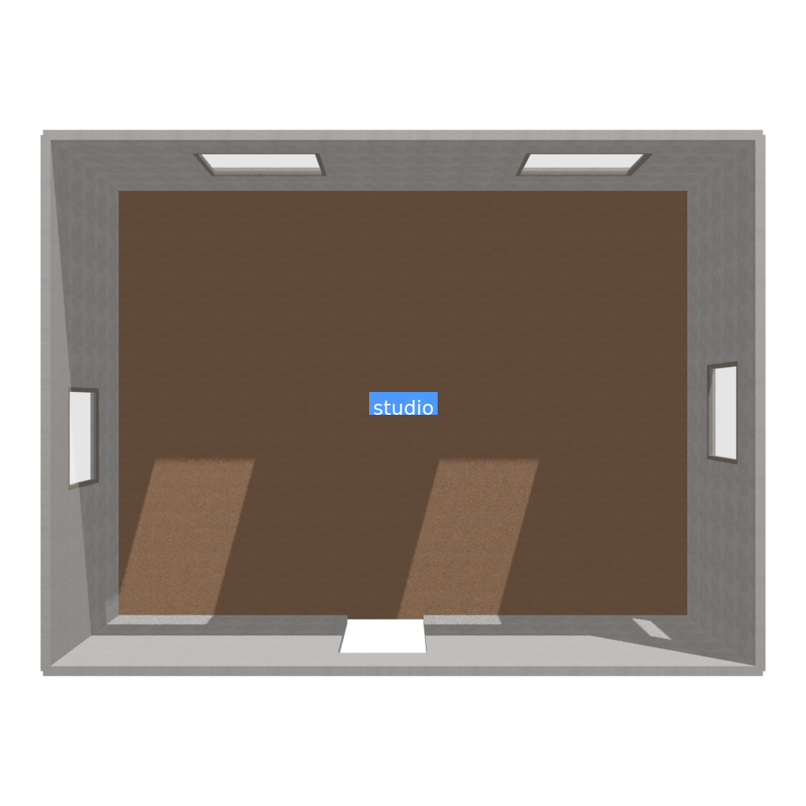

# Workflow Understanding

## 1. Floor-Plan-Only Generation

SceneSmith is organized as a staged pipeline. A full run may start retrieval or
generation services for materials, static assets, and articulated assets.
Those services are not needed when the requested stage range is only:

```text
floor_plan -> floor_plan
```

The important engineering change was stage-aware service startup. When the
start and stop stages are both `floor_plan`, the pipeline can avoid unrelated
heavy dependencies while preserving the original behavior for all other runs.

The resulting floor-plan run produces several useful representations:

- PNG: quick visual inspection.
- DMD YAML: structured room description.
- SDF: simulation-oriented room geometry.
- BLEND: editable scene source.
- GLB: portable browser-viewable scene.



## 2. Static Room Assembly

Furniture generation and furniture placement are separate concerns.

The seven furniture GLBs contain geometry, while `scene_state.json` contains
the placement state: translation, rotation, bounding boxes, and identifiers.
The assembly script therefore:

1. Loads the room BLEND file.
2. Reads the saved scene state.
3. Imports each existing furniture GLB.
4. Applies its saved world transform.
5. Checks grounding and room bounds.
6. Saves a combined BLEND file.
7. Exports one complete GLB.

This separation makes it possible to rebuild a scene without rerunning an
expensive 3D generation model.

## 3. Articraft URDF Integration

The Articraft microwave is represented as a URDF robot-like hierarchy:

```text
microwave root
  -> microwave body
  -> front door joint -> front door
  -> tray joint -> sliding tray -> turntable joint -> turntable
  -> upper knob joint -> upper knob
  -> lower knob joint -> lower knob
```

The integration process parses:

- links;
- visual origins and geometry;
- parent-child relationships;
- joint types;
- joint axes;
- lower and upper limits.

The hierarchy is recreated in Blender using parented objects. Joint metadata is
stored as custom properties so it survives GLB export.

## 4. Browser Interaction

The Three.js viewer loads the complete GLB and traverses its node tree. Nodes
with URDF joint metadata become UI controls.

For each joint, the viewer stores its rest transform and applies:

```text
revolute / continuous: base_rotation * axis_angle(axis, value)
prismatic:              base_position + axis * value
```

The viewer must also convert axes from Blender coordinates to Three.js
coordinates. Without this conversion, a correct URDF axis may appear to rotate
or translate in the wrong direction in the browser.

## 5. Validation and Version Freeze

The final workflow is:

```text
build from saved assets
  -> validate file structure
  -> validate placement
  -> sample articulated motion
  -> check collisions
  -> check accessibility
  -> test browser controls
  -> write acceptance report
  -> write SHA-256 manifest
  -> freeze as a new version
```

The base stable version is never edited in place. Each accepted change creates
a new sibling version, which makes comparison and rollback straightforward.

## 6. Multi-URDF Assembly

Scaling from one microwave to three articulated assets requires namespacing.
Generic node names such as `LINK::door` or `JOINT::hinge` can collide when
several URDF files are imported into one Blender scene.

The multi-object assembler therefore uses identities such as:

```text
ARTICRAFT::entry_door
JOINT::entry_door::frame_to_door
ARTICRAFT::double_door_cabinet
JOINT::double_door_cabinet::left_hinge
```

Each joint retains its asset name, URDF joint name, type, axis, and limits.
The Three.js viewer discovers all eight controls from the same GLB.

## 7. Complete Prompt-to-Scene Workflow

The practical workflow used in Week 4 is:

```text
one-sentence room prompt
  -> SceneSmith floor-plan agent plans room boundaries and openings
  -> SceneSmith furniture agent selects furniture categories and placement
  -> image generation creates a reference image for each generated asset
  -> Hunyuan3D Mini converts each reference image into a static furniture GLB
  -> scene_state.json stores the furniture transforms and dimensions
  -> Blender assembles the room structure and existing furniture GLBs
  -> Articraft URDF assets add links, joints, axes, and motion limits
  -> Blender exports one complete GLB with hierarchy and joint metadata
  -> Three.js loads the GLB and creates browser joint controls
  -> validation samples poses, checks collisions and accessibility, and freezes
     an accepted version
```

SceneSmith does not directly produce every mesh from text in one operation.
The agents first turn the prompt into structured scene decisions. Geometry
generation, placement, articulation, export, and validation are separate
stages. This separation lets an accepted room be rebuilt without regenerating
its furniture.

For the Week 4 static furniture run, the geometry backend was Hunyuan3D Mini in
shape-only mode. SAM3D, HSSD, Objaverse, ArtVIP retrieval, and material
retrieval were not used. The articulated microwave, entrance door, and cabinet
were existing Articraft URDF assets rather than Hunyuan3D outputs.

## 8. Where Each Representation Is Stored

| Scene information | Format | Purpose |
| --- | --- | --- |
| Floor-plan preview | PNG | Fast visual inspection |
| Floor, walls, and windows | GLTF + BIN | Separate room geometry and buffers |
| Editable floor plan | BLEND | Blender source scene |
| Drake scene references | DMD YAML | Structured model composition |
| Room geometry | SDF | Simulation-oriented geometry |
| Individual static furniture | GLB | Portable generated mesh |
| Furniture placement | JSON | Position, rotation, dimensions, and identifiers |
| Articulated object source | URDF | Links, joints, axes, limits, visuals, and collisions |
| Complete editable scene | BLEND | Reassembly, correction, and export source |
| Complete browser scene | GLB | Geometry, materials, hierarchy, and metadata |
| Browser application | HTML + JavaScript | Rendering and joint controls |
| Validation evidence | JSON + Markdown | Machine-readable and human-readable checks |
| Recorded demonstration | MP4 | Portable presentation artifact |

The most important distinction is:

```text
GLB stores what the browser displays.
BLEND stores what Blender can continue editing.
JSON stores where generated furniture is placed.
URDF stores how an articulated object is connected and allowed to move.
SDF / DMD YAML store simulation-oriented room and scene structure.
```
